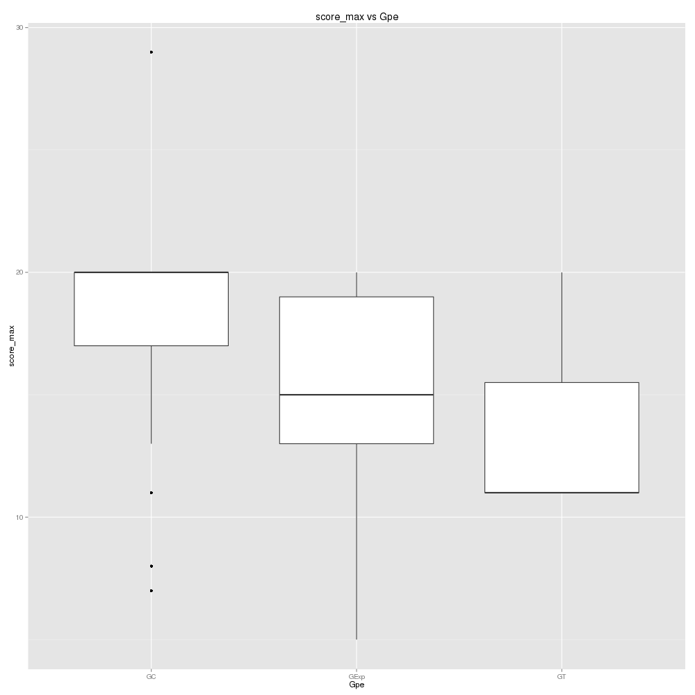

Some ggplot2 examples in R, including:

 - confInterval

 

 - variWidth/mosaicChart

 

 - barPlot

 

 - barPlot

 

 - barPlot

 

 - compose/scores

 

 - compose/scores

 

 - compose/diamond

 

 - compose/diamond

 

and so on, please enjoy :)

